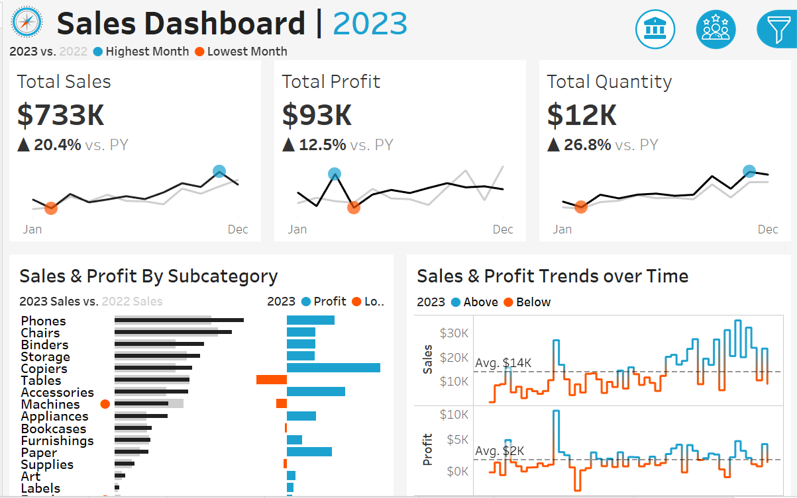

📊 Sales Performance Dashboard (Tableau)

🔍 Project Overview
This dashboard analyzes sales performance across regions, product categories, and time periods to uncover business insights.

🎯 Business Objectives
- Track overall sales and profit performance
- Identify top-performing regions and categories
- Analyze monthly and yearly sales trends

📈 Key Metrics
- Total Sales
- Total Profit
- Profit Ratio
- Sales Trend

🛠 Tools Used
- Tableau
- Excel / CSV

💡 Key Insights
- West region contributes the highest sales
- Technology category shows the highest profitability
- Sales peak during the last quarter of the year

📷 Dashboard Preview

🔗 Tableau Public Link
https://public.tableau.com/app/profile/t.prathyusha.reddy/vizzes
